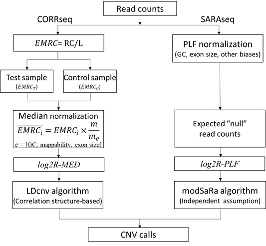

# CORRseq and SARAseq
Copy number variation detection by whole-exome-sequencing (WES) data.
## Author
Fei Qin, Xizhi Luo, Guoshuai Cai, Feifei Xiao
## Description
We have previously shown evidence of the genomic correlation structure in SNP array data and developed a novel chromosomal breakpoint detection algorithm, LDcnv, which showed significantly improved detection power through integrating the correlation structure in a systematic modeling manner. However, it remains unexplored whether the genomic correlation exists in WES data and how such correlation structure integration can improve CNV detection accuracy. 
Here, we proposed a correlation-based method, CORRseq, as a novel release of the LDcnv algorithm in profiling WES data. We also developed an alternative independent-based method in parallel, so as referred to SARAseq, which was built upon on our existing method modSaRa.
## General workflow
**CORRseq** requires WES read count data from both testing and control samples as inputs. Read counts are normalized using a **median normalization approach** to adjust exon length, GC-content, and mappability biases. Logarithm transformation of the ratios of normalized data from the testing and the pooled control samples is calculated. CORRseq implements a correlation-based algorithm (LDcnv) to identify CNVs. 

**SARAseq** only requires WES read count data from testing samples. Read counts are normalized using a **PLF-based approach** to mitigate observable biases (GC content, amplification efficiency, and exon size) and latent systemic biases and estimate the expected “null” read counts. Logarithm of the observed read counts and expected “nulls” are calculated. SARAseq uses an algorithm assuming independence (modSaRa) for the CNV identification.



### Prerequisite
CORRseq and SARAseq
```r
install.packages("devtools")
library(devtools)
install_github("FeifeiXiaoUSC/modSaRa",subdir="package")
install_github("FeifeiXiaoUSC/CORRseq-and-SARAseq",subdir = "CORRseq")
install_github("FeifeiXiaoUSC/CORRseq-and-SARAseq",subdir = "SARAseq")
```
CODEX2 (https://github.com/yuchaojiang/CODEX2)
```r
devtools::install_github("yuchaojiang/CODEX2/package")
```
EXCAVATOR2:https://sourceforge.net/projects/excavator2tool/files/EXCAVATOR2_Package_v1.1.2.tgz/download

samtools: https://github.com/samtools/samtools/blob/develop/INSTALL

### Getting raw read count data
Using samtools (follow EXCAVATOR2's mannual), this requires linux enviroment (e.g., ubuntu OS).
```r
EXCAVATOR2> perl EXCAVATORDataPrepare.pl ExperimentalFilePrepare.w50000.txt processors 6 --target MyTarget_w50000 --assembly hg19
```
Using Rsamtools (follow CODEX2'S manual http://htmlpreview.github.io/?https://github.com/yuchaojiang/CODEX2/blob/master/demo/CODEX2.html)

Example output
```r
> Y_qc[1:5,1:5]
                  NA06994 NA07000 NA07056 NA07357 NA10847
1:2938187-2939417    1093     831     541     767    1072
1:3102653-3103043     152     356     136     291     160
1:3160585-3160735      82      63      33      90      90
1:3301632-3301902     264     227     157     181     245
1:3327905-3329375     969     962     405     655     867
```
### Normalization
The default normalization method for **CORRseq** is EXCAVATOR2 median normalization, the following procedure generate **log2R-MED** for each testing sample.
```r
EXCAVATOR2> perl EXCAVATORDataAnalysis.pl ExperimentalFileAnalysis.w50K.txt --processors 6 --target MyTarget_w50K --assembly hg19 --output /.../OutEXCAVATOR2/Results_MyProject_w50K --mode ...
```
log2R-MED (Log2R) for one sample:
```r
Chromosome	Position	Start	End	Log2R	SegMean	Class
1	20201	10202	30201	0.542625446945389	0.363527762355447	OUT
1	40201	30202	50201	0.339622160832357	0.363527762355447	OUT
1	65567	65434	65700	0.708845027878818	0.363527762355447	IN
1	65902	65756	66048	0.341973588227948	0.363527762355447	IN
1	69549	69090	70008	0.225902832162026	0.363527762355447	IN
1	80208	70209	90208	0.385081936482947	0.363527762355447	OUT
1	100208	90209	110208	-0.511761046706045	-0.642331505481395	OUT
1	120208	110209	130208	-0.389784914264831	-0.642331505481395	OUT
```
The default normalization method for **SARAseq** is CODEX2 PLF normalization, the following procedure generate a **log2R-PLF** data matrix for all samples.
```r
normObj.null <- normalize_null(Y_qc = Y_qc,
                               gc_qc = gc_qc,
                               K = 1:5, N = N)
Yhat.null <- normObj.null$Yhat
log2R-PLF=log2(Y_qc/Yhat.null)
```
### CNV calling
Run CORRseq and SARAseq with log2R-MED and log2R-PLF
```r
CORRseq(log2R-MED, map)
SARAseq(log2R-PLF, map)
```


The output file is tab delimited and has 9 columns with rows corresponding to CNV events. The columns include sample names, chromosome, CNV start marker, CNV end marker, CNV start position, CNV end position, CNV length in b, CNV length in markers, CNV status (deletion or duplication).
```r
   V1 V2                V3                V4       V5       V6    V7 V8  V9
1   1  1         rs3765736  chr1_3696000_C_T  3616601  3696000 79399 18 del
2   1  1  chr1_6504890_C_T         rs2986739  6504890  6548056 43166  6 del
3   1  1 chr1_10674492_C_T chr1_10766389_C_T 10674492 10766389 91897 44 del
4   1  1 chr1_10871049_A_C chr1_10879164_C_T 10871049 10879164  8115  6 del
5   1  1 chr1_11002579_A_C          exm13826 11002579 11009716  7137  6 del
6   1  1         rs9430624         rs3737967 11763677 11847449 83772 48 del
7   1  1          rs848428 chr1_12923108_C_T 12866590 12923108 56518 11 del
8   1  1         rs6663855          rs223226 18643577 18650794  7217  6 del
9   1  1       kgp15160198       kgp15297026 19208316 19217299  8983  7 del
10  1  1 chr1_21894307_C_T        rs10917023 21894307 21925603 31296  9 del
```
